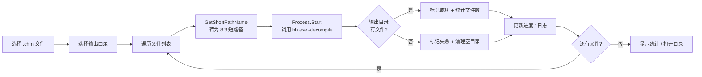

<p align="center">
  <h1 align="center">CHM Converter</h1>
  <p align="center">将 CHM 帮助文件批量转换为 HTML 网页的现代 Windows 桌面工具</p>
</p>

<p align="center">
  
  
  
  
</p>

---

## ✨ 功能特性

- 🗂️ **批量选择** — 一次选择多个 `.chm` 文件，支持去重
- 🚀 **批量转换** — 自动逐个反编译 CHM 为完整 HTML 站点
- 📂 **自定义输出** — 每个 CHM 独立子文件夹，自动创建目录结构
- 📊 **实时进度** — 进度条 + 当前文件状态，直观展示转换进度
- 📝 **双通道日志** — UI 彩色日志 + 文件日志（按天切割）
- 🎨 **三套主题** — Dark Purple / Dark Blue / Light Modern，下拉菜单即时切换
- 🪟 **现代 UI** — 自定义标题栏、圆角窗口、无缝窗口控制按钮
- 🔒 **零依赖** — 纯 .NET 8 WPF，无任何 NuGet 包
- 📈 **统计面板** — 成功/失败计数、转换耗时一览
- 🔄 **可取消** — 支持中途取消，自动清理已生成的临时文件
- 📜 **独立脚本** — 附带 `chm2html.bat`，无需 GUI 也能用

---

## 🖥 界面


---

## 🎨 主题

内置三套主题，点击标题栏 🌓 下拉选择：

| 主题 | 风格 | 强调色 |
|------|------|--------|
| 🟣 **Dark Purple** | VS Code / Discord 暗色风 | `#6C5CE7` 紫 |
| 🔵 **Dark Blue** | JetBrains / Azure 暗色风 | `#4A90D9` 蓝 |
| ⚪ **Light Modern** | Windows 11 亮色风 | `#6C5CE7` 紫 |

主题通过 `DynamicResource` 实时切换，所有控件颜色即时更新，无需重启。

---

## 📁 项目结构

```
CHMConverter/
├── App.xaml                        # 应用程序资源、控件样式
├── App.xaml.cs                     # 主题切换逻辑
├── MainWindow.xaml                 # 主窗口界面（自定义标题栏）
├── MainWindow.xaml.cs              # 窗口控制 & 交互逻辑
├── CHMConverter.csproj             # .NET 8 WPF 项目文件
├── app.manifest                    # Windows 应用清单
├── chm2html.bat                    # 独立 BAT 脚本
├── Services/
│   ├── ChmConverterService.cs      # CHM → HTML 转换核心
│   └── LogService.cs               # 双通道日志服务
├── Themes/
│   ├── DarkPurple.xaml             # 暗紫主题
│   ├── DarkBlue.xaml               # 暗蓝主题
│   └── LightModern.xaml            # 亮色主题
└── .vscode/
    ├── launch.json                 # VS Code 调试配置
    └── tasks.json                  # VS Code 构建任务
```

---

## 🚀 快速开始

### 环境要求

| 项目 | 说明 |
|------|------|
| 操作系统 | Windows 10 / 11 |
| .NET SDK | [.NET 8.0](https://dotnet.microsoft.com/download/dotnet/8.0) 或更高 |
| hh.exe | Windows 自带（`C:\Windows\hh.exe`） |

### 构建 & 运行

```bash
# 克隆项目
git clone https://github.com/yourname/CHMConverter.git
cd CHMConverter

# 还原依赖 & 构建
dotnet restore
dotnet build -c Release

# 运行
dotnet run

# 发布独立可执行文件
dotnet publish -c Release -o ./publish
```

### VS Code 调试

已预置 `launch.json` / `tasks.json`，直接按 `F5` 启动调试。

---

## 📖 使用说明

| 步骤 | 操作 |
|------|------|
| **1. 选择文件** | 点击「📁 选择 CHM 文件」→ 多选 `.chm` 文件 |
| **2. 选择输出** | 点击「📂 选择输出目录」→ 选择 HTML 存放位置 |
| **3. 开始转换** | 点击「🚀 开始转换」→ 等待进度完成 |
| **4. 查看结果** | 自动打开资源管理器定位到输出目录 |

> 💡 每个 CHM 文件生成一个以文件名命名的独立子文件夹，内含完整的 HTML/CSS/JS/图片。

---

## 🔧 实现原理

### 转换流程



### 技术要点

1. **反编译引擎** — 调用 Windows 内置 `hh.exe -decompile` 命令
2. **路径处理** — 使用 `GetShortPathName` API 将路径转为 8.3 短格式，确保 hh.exe 正确解析参数
3. **异步执行** — `async/await` + `CancellationToken` + `Process.WaitForExitAsync`，UI 不阻塞
4. **取消安全** — 取消时自动 `process.Kill(entireProcessTree: true)` 清理进程树
5. **超时保护** — 单文件 5 分钟超时，防止卡死

---

## 📝 日志

日志同步输出到两个位置：

### UI 界面

底部日志区域，按级别着色：

| 级别 | 标识 | 颜色 | 含义 |
|------|------|------|------|
| `INFO` | `[INFO]` | 灰色 | 普通操作信息 |
| `OK` | `[OK]` | 绿色 | 操作成功 |
| `WARN` | `[WARN]` | 黄色 | 警告信息 |
| `ERR` | `[ERR]` | 红色 | 错误信息 |

### 本地文件

- 路径：`程序目录/Logs/CHMConverter_yyyyMMdd.log`
- 按天自动切割，无需手动管理
- 格式：`[yyyy-MM-dd HH:mm:ss.fff] [LEVEL] message`

---

## 🔨 独立 BAT 脚本

不想打开 GUI？直接用 `chm2html.bat`：

```batch
# 转换单个文件
chm2html.bat "D:\docs\manual.chm"

# 指定输出目录
chm2html.bat "D:\docs\manual.chm" "D:\output"

# 批量转换整个目录
chm2html.bat "D:\chm_files"

# 支持拖放：把 .chm 文件拖到 chm2html.bat 上即可
```

---

## 🎯 设计原则

- **零依赖** — 不引用任何 NuGet 包，仅使用 .NET 内置 API
- **极简架构** — code-behind 模式，无 MVVM 框架，服务层与 UI 层清晰分离
- **Windows 原生** — 依赖系统自带的 `hh.exe`，工具本身只做编排
- **即时可用** — 无需安装配置，构建后即用

---

## ❓ 常见问题

<details>
<summary><b>Q: 提示「未找到 hh.exe」</b></summary>
<p><code>hh.exe</code> 是 Windows 自带的 HTML Help 查看器。如果缺失，请确认系统为 Windows 10/11 完整版（非精简版）。</p>
</details>

<details>
<summary><b>Q: 转换后中文乱码</b></summary>
<p>CHM 文件编码取决于制作时的设置。工具不做编码转换，生成的 HTML 保持原始编码。请用浏览器打开并手动切换编码查看。</p>
</details>

<details>
<summary><b>Q: 日志显示成功但输出目录为空</b></summary>
<p>通常是文件路径包含空格或特殊字符导致 hh.exe 参数解析失败。项目已通过短路径 API 解决此问题，如仍遇到请提交 Issue。</p>
</details>

<details>
<summary><b>Q: 如何自定义主题？</b></summary>
<p>编辑 <code>Themes/</code> 目录下的 <code>.xaml</code> 文件，修改颜色值即可。所有颜色通过 <code>DynamicResource</code> 引用，修改后即时生效。</p>
</details>

---

## 🛠 技术栈

| 技术 | 说明 |
|------|------|
| .NET 8.0 | 运行时 & SDK |
| WPF | Windows 桌面 UI 框架 |
| C# 12 | 编程语言 |
| WindowsChrome | 自定义标题栏 & 窗口圆角 |
| hh.exe | Windows HTML Help 反编译工具 |
| GetShortPathName | Win32 API 短路径转换 |

---

## 📄 许可证

[MIT License](https://opensource.org/licenses/MIT) — 可自由使用、修改、分发。

---

## ⚠️ 特殊声明

本项目代码通过 **AI 交互生成**，未经过完整的安全审计和生产环境验证。

- 使用前请自行审查代码逻辑与安全性
- 转换操作依赖系统 `hh.exe`，仅在本地运行，不上传任何数据
- 作者不对因使用本工具造成的任何数据丢失或系统问题承担责任

**请自行判断软件风险后使用。**

---

## 🤝 贡献

欢迎提交 Issue 和 Pull Request！

1. Fork 本项目
2. 创建特性分支 (`git checkout -b feature/amazing`)
3. 提交更改 (`git commit -m 'Add something amazing'`)
4. 推送到分支 (`git push origin feature/amazing`)
5. 发起 Pull Request